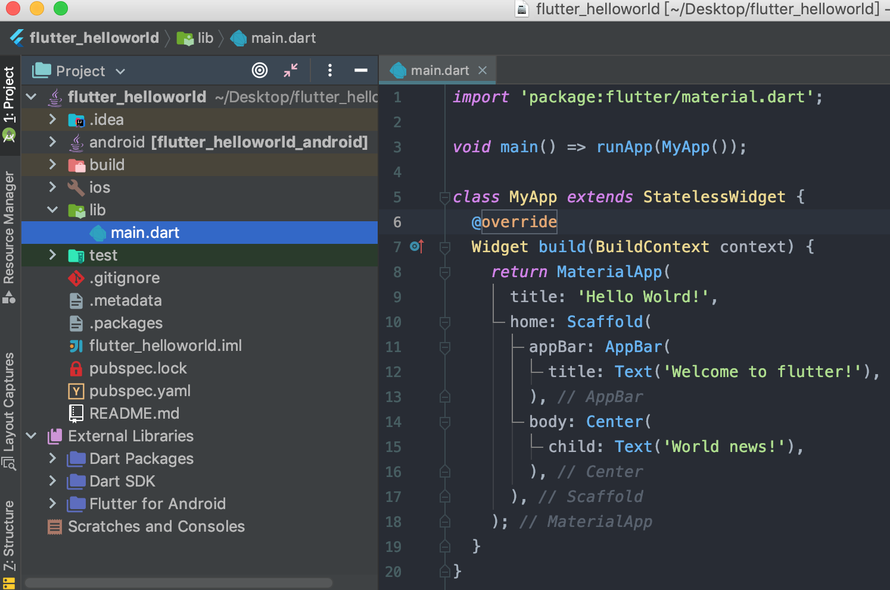

## 一 创建HellowWorld程序

在01章节新建的flutter基础项目中，由于是AS帮助创建的，我们将/lib目录下的`main.dart`内容修改为一个HelloWorld项目：
```dart
import 'package:flutter/material.dart';             // 导包

void main() => runApp(MyApp());                     // 入口函数

class MyApp extends StatelessWidget {               // 应用继承自无状态组件
  @override
  Widget build(BuildContext context) {              // 返回一个组件
    return MaterialApp(                              // 返回 MaterialApp 这个组件
      title: 'Hello Wolrd!',
      home: Scaffold(                               // home是窗口的主体，可以使用脚手架组件Scaffold搭建内容
        appBar: AppBar(   
          title: Text('Welcome to flutter!'),
        ),
        body: Center(                               // Center是个布局组件
          child: Text('World news!'),
        ),
      ),
    );
  }
}
```

执行AS的run，即可展示helloworld项目。

## 二 HellowWorld程序整体概览

#### 2.0 目录介绍

helloworld项目截图：
  

常用文件与目录：
- lib：flutter应用目录，工程代码放在此处
- ios/android：flutter与原生交互时代码目录
- pubspec.yaml：项目依赖文件

#### 2.1 入口文件

`/lib`目录下的一个main.dart文件，都会有且仅有一个main()函数，该函数是flutter项目的入口函数。  

`void main() => runApp(Widget app)`其实是dart的语法糖，原本格式是：
```
void main() {
    return runApp(Widge app);
}
```

如果不调用`runApp()`函数，那么该用用将会是一个执行dart的控制台应用，因为`runApp`其实是框架Flutter的入口。

#### 2.2 Material Design设计风格

`Material Design`是谷歌推出的一台视觉设计语言，每一个dart文件第一行几乎都会导入`flutter/material.dart`包。  

该包是`Material Design`的基础包，里面包含文本输入框Text、图标Icon、图片Image、行排列布局Row、列排列布局Column、装饰器Decoration、动画等组件。