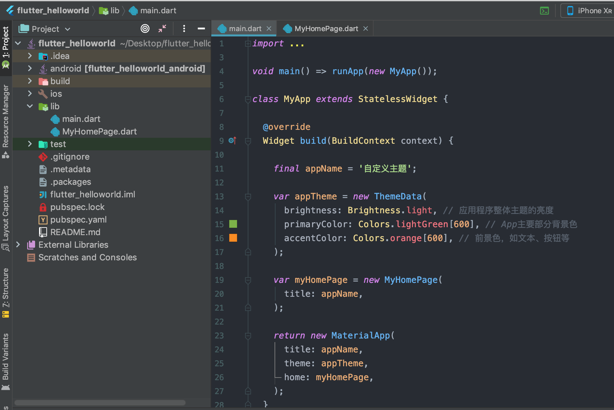

## 一 组件状态

无状态组件（Stateless Widget）是不可变的，即属性不能改变，所有的值都是最终的。  

有状态组件（Stateful Widget）持有的状态可能在Widget声明周期中发生改变，实现一个有状态组件至少需要两个类：
- StatefulWidget类
- State类，StatefulWidget类本身是不变的，但是State类在Widget生命周期中始终存在

在02-03章节中，我们自定义的MyHomePage必须继承自StatefulWidget类：
```dart
class MyHomePage extends StatelessWidget{}
```

重写createState方法：
```dart
@override
MyHomepageState createState() => new _MyHomepageState();
```

状态类也必须继承自 State 类：
```dart
class _MyHomepageState extends State<MyHomepage>
```

基于03章节案例，修改MyHomePage.dart文件为：
```dart
import 'package:flutter/foundation.dart';
import 'package:flutter/material.dart';

// MyHomePage 本身修改为继承自StatefulWidget，并重写 createState 方法
class MyHomePage extends StatefulWidget {

  final String title;

  MyHomePage({Key key, @required this.title}) : super(key: key);

  // 重写 createState方法
  @override
  _MyHomePageState createState() => new _MyHomePageState();

}

// 新建 _MyHomePageState 状态类，继承自State
class _MyHomePageState extends State<MyHomePage> {

  // 一个计数器示例
  int _count = 0;

  void _incrementCounter() {
    setState((){              // 调用State类里的setState方法，修改状态值，即计数器+1
      _count++;
    });
  }

  @override
  Widget build(BuildContext context) {

    return new Scaffold(

      appBar: new AppBar(
        title: new Text(widget.title),
      ),

      body: new Center(
        child: new Container(
          color: Theme.of(context).accentColor,     // 获取主题的accentColor
          child: new Text(
            '计数器值为：$_count',                    // 板顶计数器值
            style: Theme.of(context).textTheme.title,
          ),
        ),
      ),

      floatingActionButton: new FloatingActionButton(
        onPressed: _incrementCounter,             // 绑定按钮调用函数
        tooltip: 'Increment',
        child: new Icon(Icons.add),
      ),

    );
  }

}
```

展示效果：
